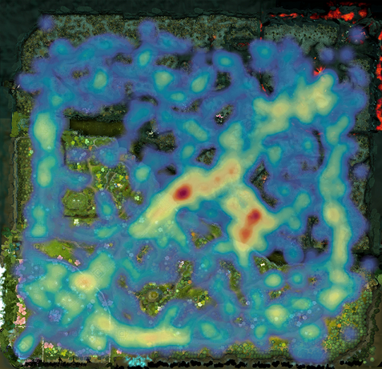
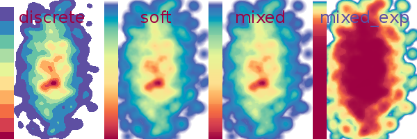
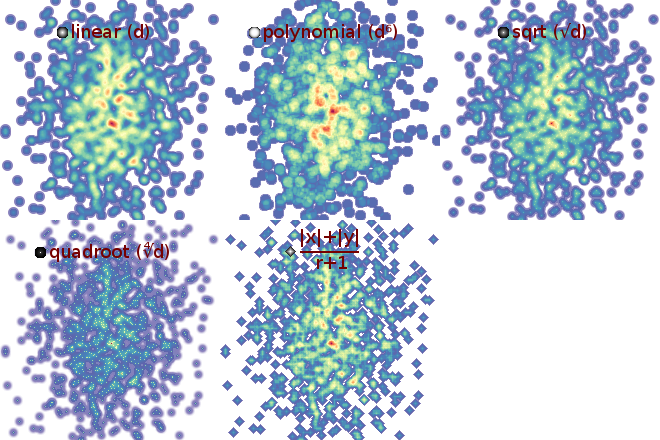

heatmap
=======

High performance C heatmap generation library.

Not your typical website-user-focus-heatmap library!
(Even-though it might be abused for that purpose due to the high performance.)

[](examples/ti3_deaths_full.jpg)

**Note:** While the library is fully functional and thoroughly tested,
the best possible performance has not been attained yet. I'm still trying out
various optimizations in other branches. See Tuning below.

What exactly?
=============

This is a simple, low-level, high-performance heatmap creation library written
in C. The reason it is written in C is that it is intended to be easily wrapped
and/or called from higher-level languages.

So, what's in here? (Buzzword-list incoming)

- Creation of **arbitrarily-sized** heatmaps.
- The heatmaps can be either **normalized** or **saturated**.
- Comes with gorgeous **colorschemes**, but you can also use **your own**.
- You can declare **custom stamps** for more artistic freedom.
- It's all strict **ANSI C89** packed into a single .h/.c tandem that you can
  simply **drop into your project** and start using.
- It comes with **extensive unit-tests** and ran through [valgrind](http://valgrind.org/);
  it is thus more likely to contain less bugs, or so they say.
- It has been **thoroughly benchmarked**, assuring you high performance.

What's not in there, which might be present in other heatmap packages?

- It doesn't automatically size your heatmap according to your data.
  This means you need to know the min/max of your datapoints beforehand.
- It doesn't generate image files. You read that right - **it doesn't generate
  image files**. What it does generate is pixel-data, which you can then store
  into an image file, upload to a server, upload to a GPU texture, or feed to
  your cat. Well maybe not all of these.
- It also doesn't take care of your grandparents/children.

What the hell, no image file creation?
======================================

Yep. This library is meant to be embedded in larger things or used from higher-
level languages, all of which have their own image file creation idiosyncraties.
I love tiny, self-contained libraries that play well (i.e. simply don't play)
with their environment.

If you really, really want to generate png images from C and don't already have
any means to do so (what kind of weirdo are you, anyways?), go ahead and use
some one-file image library such as the awesome [LodePNG](http://lodev.org/lodepng/).
That's actually what is being done in all of the examples.

Why? (When there is so many others)
====

The short answer is because I can.
While investigating data from [DOTA2](http://dota2.com/)
[replay files](https://github.com/dschleck/edith), I wanted to generate
heatmaps of the players' positions at various events. None of the heatmap
libraries I have tried satisfied my needs; they were either to unflexible or
too slow. (I wanted to process thousands of games with thousands of points per
game.) Of course, this library is both flexible and highly efficient :)

The main packages I played with (I will definitely have missed some) are:

- [heatmap.py](http://jjguy.com/heatmap), which:
    - Doesn't normalize! It only saturates.
    - Doesn't allow a custom colorscheme, and only comes with 5 ugly ones.
    - Doesn't allow for custom stamps.
- [heatmap.js](http://www.patrick-wied.at/static/heatmapjs/), which:
    - Is great, use that if you can!
    - But only for the browser, and
    - too slow when millions of points are involved.
- Your favourite dataviz library, such as
    - [matplotlib](http://matplotlib.org/gallery.html) of which I couldn't find this kind of heatmap,
    - [R](http://stackoverflow.com/questions/4885251/drawing-a-heatmap-in-r-based-on-zipcodes-only) let's not go into that...,
    - a whole bunch of [closed-source](http://pic.dhe.ibm.com/infocenter/elixent/v3r5/topic/com.ibm.ilog.elixir.doc/Content/Visualization/Documentation/Flex/Elixir_Enterprise/_pubskel/ps_elixir_corecomponents121.html) [monsters](http://www.mathworks.com/products/matlab), but
    - none of these is as easy-to-use, fast, and gorgeous as I want it.

Stop talking, show me how to use it!
====================================

Gladly!

Using without programming
-------------------------

If you just run `make`, all examples in the `examples` subdirectory will be
compiled. One of those examples is actually quite useful: It creates a heatmap
using coordinate-pairs it reads from the standard input and writes the
resulting heatmap-picture to the standard output. The intended usage is the
following:

```bash
$ head -6 points.txt
12 123
52 12
321 94
87 483
60 10
90 470

$ examples/heatmap_gen 500 500 10 < points.txt > heatmap.png
```

This will generate a `heatmap.png` picture using the points from the file.
The first two arguments (`500`) are the width and height of the heatmap picture
and the third argument (which is optional) is the radius of the stamp.

Or, in order to have a useless use of `cat`:

```bash
$ cat points.txt | examples/heatmap_gen 500 500 10 > heatmap.png
```

For example, the heatmap you saw in the introduction has been created with the
following monster command:

```bash
$ edith/build/edith replays/fountainhooks.dem | cut -d , -f 3- | awk ' !x[$0]++' | python3 edith/cvt.py | heatmap-github/examples/heatmap_gen `identify -format "%w %h" dota2map.png` 150 > deathmap.png
```

But let's now look at using the library programmatically.

Installing
----------

Since the library consists of only one header and one C file, installation
is pretty straightforward: just drop the files into your project!

For using it from other higher-level languages, you'll need to run `make`
and place the resulting `libheatmap.so` where your language expects it to be
and then use your language's C bindings to call its functions.

The idea is that people (or I) will write language-specific wrappers and setup
files (like `setup.py`, `Rakefile`, `cgo`, etc.) to make that easier.

The basics
----------

A basic usage example is called `simplest` and is provided in
[many](examples/simplest.c)
[different](examples/simplest.cpp)
[programming](examples/simplest.py)
languages in the `examples` directory. Here are some for your reading pleasure:

### In C++

```cpp
#include <random>
#include <vector>
#include <iostream>

#include "lodepng.h"
#include "heatmap.h"

int main()
{
    static const size_t w = 256, h = 512, npoints = 1000;

    // Create the heatmap object with the given dimensions (in pixel).
    heatmap_t* hm = heatmap_new(w, h);

    // This creates two normal random distributions which will give us random points.
    std::random_device rd;
    std::mt19937 prng(rd());
    std::normal_distribution<float> x_distr(0.5f*w, 0.5f/3.0f*w), y_distr(0.5f*h, 0.25f*h);

    // Add a bunch of random points to the heatmap now.
    for(unsigned i = 0 ; i < npoints ; ++i) {
        heatmap_add_point(hm, x_distr(prng), y_distr(prng));
    }

    // This creates an image out of the heatmap.
    // `image` now contains the image data in 32-bit RGBA.
    std::vector<unsigned char> image(w*h*4);
    heatmap_render_default_to(hm, &image[0]);

    // Now that we've got a finished heatmap picture, we don't need the map anymore.
    heatmap_free(hm);

    // Finally, we use the fantastic lodepng library to save it as an image.
    if(unsigned error = lodepng::encode("heatmap.png", image, w, h)) {
        std::cerr << "encoder error " << error << ": "<< lodepng_error_text(error) << std::endl;
        return 1;
    }

    return 0;
}
```

### In Python

Using `ctypes` and `PIL` for now, hopefully a wrapper soon.

```python
#!/usr/bin/env python

from os.path import join as pjoin, dirname
from random import gauss
from ctypes import CDLL, c_ulong, c_ubyte
import Image

w, h, npoints = 256, 512, 1000

# Load the heatmap library using ctypes
libhm = CDLL(pjoin(dirname(__file__), '..', 'libheatmap.so'))

# Create the heatmap object with the given dimensions (in pixel).
hm = libhm.heatmap_new(w, h)

# Add a bunch of random points to the heatmap now.
for x, y in ((int(gauss(w*0.5, w/6.0)), int(gauss(h*0.5, h/6.0))) for _ in xrange(npoints)):
    libhm.heatmap_add_point(hm, c_ulong(x), c_ulong(y))

# This creates an image out of the heatmap.
# `rawimg` now contains the image data in 32-bit RGBA.
rawimg = (c_ubyte*(w*h*4))()
libhm.heatmap_render_default_to(hm, rawimg)

# Now that we've got a finished heatmap picture, we don't need the map anymore.
libhm.heatmap_free(hm)

# Use the PIL (for example) to make a png file out of that.
img = Image.frombuffer('RGBA', (w, h), rawimg, 'raw', 'RGBA', 0, 1)
img.save('heatmap.png')
```

### Using a different colorscheme

While the default colorscheme is gorgeous, it might not fit every situation.
A few more colorschemes are shipped as _addons_ to this library in the
`colorschemes` directory; you'll have to drop those you want to use into your
project too.

After that, it's just a matter of calling a different rendering function:

```cpp
#include <colorschemes/gray.h>

// ...

heatmap_render_to(hm, heatmap_cs_b2w, &image[0]);
```

#### Shipped colorschemes

(Almost) All colorschemes shipped along with this library come in four
variants: `discrete`, `soft`, `mixed`, and `mixed_exp`. While the former three
just produce different visual styles, the last one has a meaning to his life.
Sometimes, while your heatmap comes with an intense peak at a few locations,
that peak is not what you want to show; you also want to see the texture of the
non-peaked regions. In such a case, you could either use the saturating render
function if you know a good saturation value, or you use the `mixed_exp`
variant of your favorite colorscheme and hope it looks good.



The variable-name of a colorscheme follows the `heatmap_cs_NAME_VARIANT`
pattern, where `NAME` is the name in the overview picture above and `VARIANT`
is one of `discrete`, `soft`, `mixed`, and `mixed_exp`.

I have created a page to [preview all shipped colorschemes](http://lucasb.eyer.be/projects/heatmap/colorschemes.html).

More advanced stuff
-------------------

### Rendering with saturation instead of normalization

__TODO:__ Explain this!

### Creating a custom colorscheme

If none of the shipped colorschemes satisfies you, it is quite easy to create
your own. A colorscheme is simply an array of RGBA values. The first four
values of the array are the RGBA values for the coldest heatmap value and the
last four are the RGBA values for the hottest heatmap value.

You'll usually want to have a fully transparent color like `(0, 0, 0, 0)` as
first color in the scheme, such that empty spots on the heatmap will be
transparent.

```cpp
static unsigned char awesome_greens_data[] = {
      0,   0,   0,   0,
    241, 247, 238, 255,
    213, 230, 204, 255,
    185, 214, 170, 255,
    156, 197, 135, 255,
    128, 180, 101, 255,
    102, 155,  75, 255,
     79, 121,  58, 255,
     57,  87,  41, 255,
     34,  52,  25, 255,
     12,  18,   8, 255,
    121,  58,  79, 255, // I'll top it off with a red for peaks.
};

heatmap_colorscheme_t* awesome_greens = heatmap_colorscheme_load(awesome_greens_data, 12);

// Instead of hard-coding the 12, you could also use the sizeof-operator, but
// don't forget to divide by 4, since the number of colors and not the number
// of array elements is needed:
// sizeof(awesome_greens_data)/sizeof(awesome_greens_data)/4

// Note that the data has been copied. If `awesome_greens_data` was loaded
// dynamically (e.g. from an image), it could now be deleted.

// ...
heatmap_render_to(hm, awesome_greens, &image[0]);
// ...

heatmap_colorscheme_free(awesome_greens);
```

If you feel adventurous, you may also bypass the colorscheme management
functions and use the raw structure right away. Note that if you choose to do
so, future updates might break your code.

```cpp
// awesome_greens_data = ...
heatmap_colorscheme_t awesome_greens = {
    awesome_greens_data, sizeof(awesome_greens_data)/sizeof(awesome_greens_data[0])/4
};
```

#### Using the gradientgen.go tool

The [gradientgen.go](colorschemes/gradientgen.go) is a tool which assists you
in the creation of the four variants of a colorscheme. (It's based on my
[go-colorful](https://github.com/lucasb-eyer/go-colorful) library, check it out
if you're a go hacker working with colors!)

You need to pass the discrete colors in hex format and their "positions"
between 0.0 and 1.0 as argument list. The awesome_greens from above could be
generated, including its variants, with the following lengthy command:

```bash
go run gradientgen.go colorscheme.go -name awesome_greens '#F1F7EE' 0.0 '#D5E6CC' 0.1 '#B9D6AA' 0.2 '#9CC587' 0.3 '#80B465' 0.4 '#669B4B' 0.5 '#4F793A' 0.6 '#395729' 0.7 '#223419' 0.8 '#0C1208' 0.9 '#793A4F' 1.0
```

This will generate all four variants of `awesome_greens` in the files
`awesome_greens.h` and `awesome_greens.c`, as well as a png image for each
variant. You can specify the dimensions of the png images through the `-w` and
`-h` parameters; the latter also defines how fine-grained the colorscheme will
be, as it's the size of the array.

```bash
go run gradientgen.go colorscheme.go -name awesome_greens -w 100 -h 100 '#F1F7EE' 0.0 ...
```

### Using non-default stamps

Depending on your data, heatmap size and personal preference of banana shapes,
the default stamp might not lead to best results. For example, if you want to
create a huge-resolution picture (say 16k x 16k, you might cut it into pieces
and overlay it to a google-maps style web-viewer), the tiny default stamp will
not cover enough space and your heatmap will look more like a scatterplot, or
worse!


You have just witnessed an example of this happening. Yes, right above this
paragraph; it wasn't wasted empty space, there was a heatmap! Although I scaled
it down to 512x512 not to explode your browser, you can have a look at the
[original huge heatmap](examples/hires_heatmap.png) if you are brave enough.

If that is your case, you'll have to use a differently-sized stamp. Fortunately
for you, `libheatmap` provides such a function: `heatmap_stamp_gen`. Here are
the relevant parts of the [full sample code](examples/huge.cpp) that fixes the
problem in the previous picture:

```cpp
// ...

// We definitely need a larger stamp for this huge-ass resolution!
// A radius of 128 means we'll get a (2*128+1)²=257² pixel stamp.
heatmap_stamp_t* stamp = heatmap_stamp_gen(128);

// ...

for(unsigned i = 0 ; i < npoints ; ++i) {
    // Notice the special function to specify the stamp.
    heatmap_add_point_with_stamp(hm, x_distr(prng), y_distr(prng), stamp);
}

// ...
```

The [resulting heatmap](examples/hires_heatmap_fixed.jpg) looks much better.
(Note, though, that for reasons of filesize I have stored it as .jpg, losing
transparency as well as some quality.)

### Funky stamps

Sometimes the artist within you just wants to play. But we are hackers, so the
best we can usually do is some [programmer art](http://lmgtfy.com/?q=programmer+art)
but worry not, this is better!

The stamps are actually just images with floating-point valued pixels which are
then added onto the heatmap, so there is no reason they should be round and
linear! You can load any arbitrary stamp using the `heatmap_stamp_load`
function which, just like for `heatmap_colorscheme_load`, will make a copy of
the data.

`heatmap_stamp_gen_nonlinear` is a utility function making it easy to generate
circular stamps. You give it a function which it will call for all pixels,
passing it the pixel's distance from the stamp center. One minus the value that
your function returns will be the stamp's pixel value. Here are some examples:

```cpp
auto stamp = heatmap_stamp_gen_nonlinear(10, [](float d){return d*d;});
auto stamp = heatmap_stamp_gen_nonlinear(10, [](float d){return sqrtf(d);});
```

Some variants of this, including a grayscale representation of the stamp
and the formula leading to it, are shown in the picture below:



The [full code](examples/customstamp_heatmaps.cpp) for creating these stamps
and leading to these heatmaps can be found in the examples directory too.

**Note:** There is also example code for creating custom stamps in
[python](examples/customstamps.py).

FAQ
===

Nuttin' here yet, but I like to have the structure of my documents laid out.

Tuning
======

The library is currently tuned for both of the following use-cases:

- Creating a huge heatmap with medium "density".
- Creating a lot of small heatmaps per second.

Although it is fast, it could be much faster for creating very dense heatmaps
where there are (roughly) more datapoints than pixels. This is because the
library currently keeps track of a heatmap's max while rendering a datapoint.
This max-tracking makes SIMD-optimizations useless. (Pull-requests proving the
opposite are welcome!)

If finding the maximum was postponed to rendering, the whole heatmap would have
to be walked twice each rendering: first for finding the max, then for
rendering. This sounds bad, but for those cases in which _many_ points are
added to the heatmap, but the map is only rendered once, it would allow to
speed-up the point-addition significantly: No more need for max-test, and thus
pure bit-blt, which can easily be SIMD-ed!

License: MIT
============

Copyright (c) 2013 Lucas Beyer

Permission is hereby granted, free of charge, to any person obtaining a copy of this software and associated documentation files (the "Software"), to deal in the Software without restriction, including without limitation the rights to use, copy, modify, merge, publish, distribute, sublicense, and/or sell copies of the Software, and to permit persons to whom the Software is furnished to do so, subject to the following conditions:

The above copyright notice and this permission notice shall be included in all copies or substantial portions of the Software.

THE SOFTWARE IS PROVIDED "AS IS", WITHOUT WARRANTY OF ANY KIND, EXPRESS OR IMPLIED, INCLUDING BUT NOT LIMITED TO THE WARRANTIES OF MERCHANTABILITY, FITNESS FOR A PARTICULAR PURPOSE AND NONINFRINGEMENT. IN NO EVENT SHALL THE AUTHORS OR COPYRIGHT HOLDERS BE LIABLE FOR ANY CLAIM, DAMAGES OR OTHER LIABILITY, WHETHER IN AN ACTION OF CONTRACT, TORT OR OTHERWISE, ARISING FROM, OUT OF OR IN CONNECTION WITH THE SOFTWARE OR THE USE OR OTHER DEALINGS IN THE SOFTWARE.
